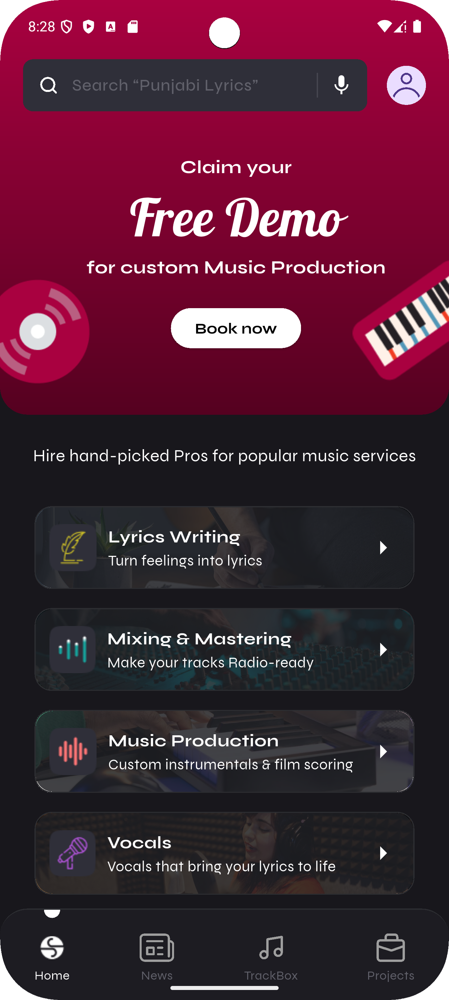
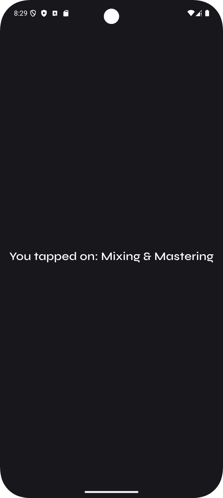

## 📱 S.Rocks.Music — Home Screen Module

A responsive Flutter app module that replicates the **Home Screen** of the ***S.Rocks.Music app***, with **Firebase integration**, **MVVM architecture**, and **Provider for state management**.
---

### 🧩 Features

* ⚡ **Realtime Firestore integration** — fetches services dynamically (no hardcoded text!)
* 🖼️ **Responsive UI** using `flutter_screenutil`
* 📦 **MVVM Architecture** (Model-View-ViewModel)
* 🔄 **Provider** for clean and scalable state management
* 📲 **Navigation** to detail screen on card tap
* 🔐 Firebase initialization using `firebase_core` and `firebase_options.dart`

---

### 📁 Folder Structure

```bash
├── lib/
│   ├── firebase_options.dart
│   ├── main.dart
│   ├── models/
│   │   ├── service_models.dart
│   ├── services/
│   │   ├── firestore_service.dart
│   ├── viewModels/
│   │   ├── service_viewmodel.dart
│   ├── views/
│   │   ├── homepage.dart
│   │   ├── serviceDetailsScreen.dart
│   ├── widgets/
│   │   ├── CustomNavBar.dart
│   │   ├── gradientBg.dart
│   │   ├── search_bar.dart
│   │   ├── service_card.dart
│   │   ├── topHeader.dart
```

---

### 🔧 Tech Stack

* **Flutter** (UI)
* **Firebase Firestore** (Backend)
* **Provider** (State Management)
* **ScreenUtil** (Responsive design)
* **MVVM** (Architecture)
* **Figma** (UI Reference)

---

### 🚀 Getting Started

#### 1. Clone the Repo

```bash
git clone https://github.com/your-username/srocksmusic-home.git
cd srocksmusic-home
```

#### 2. Install Dependencies

```bash
flutter pub get
```

#### 3. Set Up Firebase

* Install `flutterfire-cli` and add the create a project in your firebase.
* Configure the Firestore database as given in down. and also change the rules.
* Or use the existing `firebase_options.dart` from the repo
* Make sure Firebase is set up in your console with a collection:

```bash
Collection: services
Documents: 
  - id: Music_production
    title: "Music Production"
    description: "Create and refine music tracks"
    icon: "assets/icons/music_production.png"
    backgroundImage : "assets/images/music_production.png
```

#### 4. Run the App

```bash
flutter run
```

---

### 📸 Screenshots

| Home Screen                      | Tapped Detail                        |
| -------------------------------- | ------------------------------------ |
|  |  |

---

### 📌 Learnings & Highlights

* Learned to architect Flutter apps using MVVM for better scalability
* Practiced dynamic UI rendering from Firestore data
* Mastered responsiveness using `flutter_screenutil`
* Understood Provider’s role in binding UI with data layers

---

### 🤝 Credits

UI inspired by [S.Rocks.Music Figma](https://www.figma.com/design/YAsYsNFGxmoauPpSLrUMtF/Assignment---Flutter)
